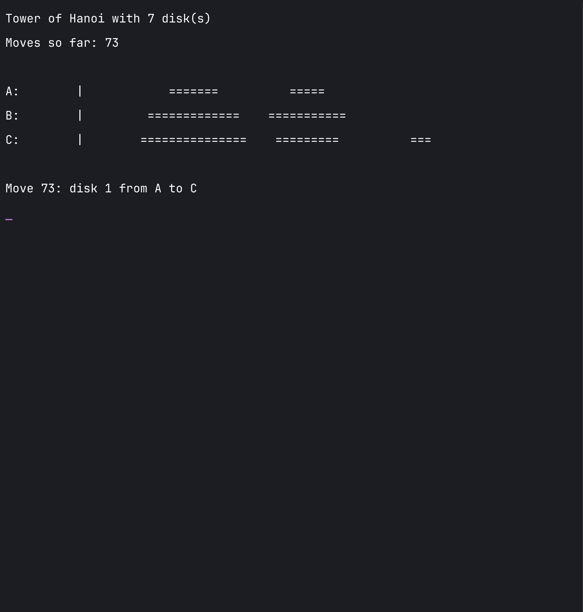
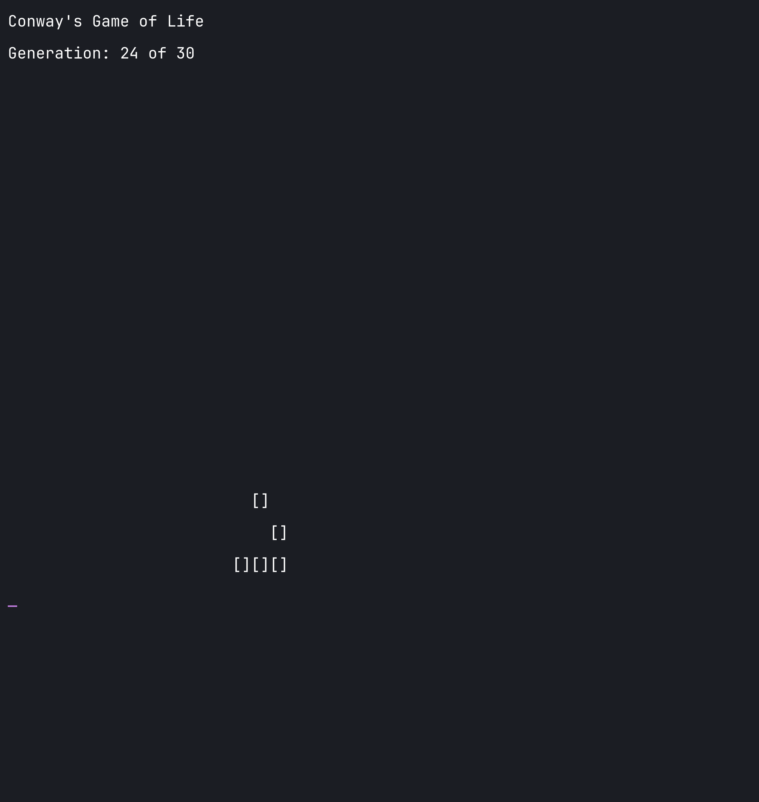

# Coding Challenge - Broadening the RISC-V High Precision Code Base and Reach

This repository contains **two scripted demonstrations** that satisfy the assignment requirement:

- **Tower of Hanoi** implemented in Bash with simple ASCII graphics
- **Conway's Game of Life** implemented in Bash with simple terminal graphics

It also includes an **optional GitHub Pages website** that presents browser-friendly versions of both demos for public sharing.

## Assignment Goal

The assignment requested:

> Please create a "Tower Of Hanoi" or "Conway's Game of Life" code demonstration in a scripted language or bash script. This can be short, just enough to demonstrate functionality with simple graphics. Ideally, you can identify and comment on the sections that demonstrate recursion and / or iteration. Optionally, place it on a publicly accessible github site.

This project goes a little further by providing **both** challenge options in Bash, with comments in the code that call out:

- the **recursive** logic in Tower of Hanoi
- the **iterative** logic in Conway's Game of Life

## Repository Contents

- `hanoi.sh` - Bash Tower of Hanoi demo
- `life.sh` - Bash Conway's Game of Life demo
- `index.html`, `style.css`, `script.js` - GitHub Pages website
- `.github/workflows/pages.yml` - GitHub Actions deployment workflow
- `report.tex` - LaTeX write-up for the assignment

## Running The Bash Demos

```bash
chmod +x ./hanoi.sh ./life.sh

bash ./hanoi.sh
bash ./hanoi.sh 5

bash ./life.sh
bash ./life.sh 30 15
```

## Tower of Hanoi

The Tower of Hanoi demo is implemented in `hanoi.sh`. It prints the peg state after each move using ASCII disks made from `=` characters.

### What it demonstrates

- **Scripted solution in Bash**
- **Simple terminal graphics**
- **Recursion**

The recursive section is in `solve_hanoi()`, where the script:

1. moves `n - 1` disks to the auxiliary peg
2. moves the largest disk
3. moves the `n - 1` disks back onto the destination peg

### Terminal Screenshot



## Conway's Game of Life

The Conway's Game of Life demo is implemented in `life.sh`. It simulates a small evolving pattern on a 2D grid and renders live cells using `[]`.

### What it demonstrates

- **Scripted solution in Bash**
- **Simple terminal graphics**
- **Iteration**

The iterative logic is highlighted in:

- `count_neighbors()` for scanning surrounding cells
- `render_board()` for drawing the full grid
- `step_generation()` for applying the rules to every cell

### Terminal Screenshot



## Optional Public Website

The repository also includes a small static website that can be deployed with **GitHub Pages**. Since GitHub Pages cannot execute Bash in the browser, the site uses JavaScript versions of the demos for presentation, while the Bash scripts remain the core assignment deliverables.

### What the website adds

- a cleaner public presentation
- a browser animation for Tower of Hanoi
- a browser simulation for Conway's Game of Life
- an easy way to share the work publicly

### Website Screenshot


